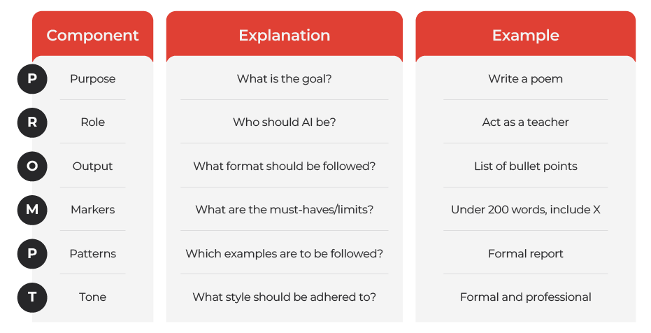
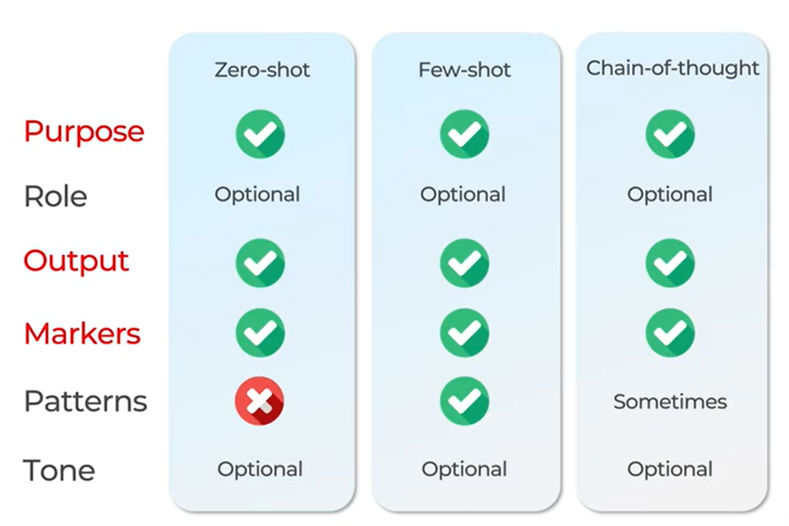

# 1. Foundations of Generative AI
How Generative AI is related to AI and ML

AI
├── Rule-Based Systems
├── Expert Systems
└── Machine Learning (ML)
    ├── Supervised Learning
    ├── Unsupervised Learning
    ├── Reinforcement Learning
    └── Deep Learning (DL)
        ├── Discriminative Models (e.g., image classification)
        └── Generative AI
            ├── Large Language Models (e.g., GPT, Llama)
            ├── GANs (e.g., DALL-E, Stable Diffusion)
            ├── VAEs
            └── Multimodal Models (e.g., Sora, Gemini)

**Hallucination**: When a model generates information that is not based on its training data or reality. AI models can state a fact that is incorrect or fabricated.

# 2. How it works
Prompt → Tokens → Embeddings → Transformer (with self-attention) → Generated Tokens → Response

A simple guide to how Generative AI (e.g., ChatGPT) turns a prompt into a response, using the example: "What is the capital of France?"

1. Prompt: The Starting Point
    - Your input text or question.
    - Example: "What is the capital of France?"
    - Role: Tells the model what to process.

2. Tokens: Breaking It Down
    - Splits the prompt into small units (tokens: words, subwords, or punctuation).
    - Example: ["What", "is", "the", "capital", "of", "France", "?"]
    - Each token gets a unique ID (e.g., "France" = ID 3056).
    - Role: Makes text manageable for the model.

3. Embeddings: Adding Meaning
    - Converts tokens into numerical vectors capturing their meaning.
    - Example: "France" → [0.12, -0.45, 0.89, ...] (e.g., 512 numbers).
    - Related tokens (e.g., "France" and "Paris") have similar vectors; unrelated ones (e.g., "France" and "banana") differ.
    - Learned during training to reflect patterns (e.g., "capital of X" → city).
    - Role: Helps the model understand context.

4. Transformer: Processing the Input
    - The neural network that analyzes embeddings.
    - Uses self-attention: Each token checks others to understand relationships (e.g., "France" focuses on "capital").
    - Multiple layers (e.g., 12–96) refine context.
    - Example: Recognizes "capital of France" means a city is expected.
    - Role: Connects ideas and prepares for output.

5. Generating Tokens: Building the Response
    - Predicts the next token one at a time based on probabilities.
    - Example: Predicts "Paris" (80% chance) over "Lyon" (10%), then adds ".".
    - Repeats until complete (e.g., stops at period).
    - Converts tokens back to text: ["Paris", "."] → "Paris."
    - Role: Creates the response step by step.

6. Output: The Final Answer
    - Combines generated tokens into readable text.
    - Example: "Paris."
    - Role: Delivers the final response to the user.

**Quick Example Flow**
- Prompt: "What is the capital of France?"
- Tokens: ["What", "is", "the", "capital", "of", "France", "?"]
- Embeddings: Vectors for each token (e.g., "France" → [0.12, ...]).
- Transformer: Links "capital" and "France," predicts city name.
- Generated Tokens: ["Paris", "."]
- Output: "Paris."

# 3. Prompt Framework

Purpose: Write a poem
Role: Act as a 19th century poet
Output: As a Paragraph
Markers: Under 200 words, include the word Swan
Patterns: In the format attached
Tone: Creative and soothing

# 4. Advanced Prompting Techniques

**Zero-Shot Prompting**
What it is: A technique where the model generates a response to a task with only a clear instruction, without examples.
Example: "Summarize this article in 100 words."
Where to use it: General tasks like summarization, translation, or simple Q&A with well-defined instructions.
How it works: The model relies on its pre-trained knowledge to interpret and respond to the prompt directly.

**Few-Shot Prompting**
What it is: A method where the model is given 1–3 examples of input-output pairs to guide its response to a new prompt.
Example: "Translate: ‘Hello’ → ‘Hola’, ‘Goodbye’ → ‘Adiós’, now translate ‘Thank you’."
Where to use it: Tasks requiring specific patterns, like translations, code generation, or formatting.
How it works: Examples provide context, enabling the model to adapt its output based on the demonstrated pattern.

**Chain-of-Thought (CoT) Prompting**
What it is: A technique that prompts the model to break down complex problems into step-by-step reasoning before answering.
Example: "Solve 5 + 7 × 2. Show your reasoning step by step."
Where to use it: Mathematical problems, logical reasoning, or coding tasks needing detailed analysis.
How it works: The model processes the task sequentially, explaining each step, which improves accuracy for multi-step problems.
