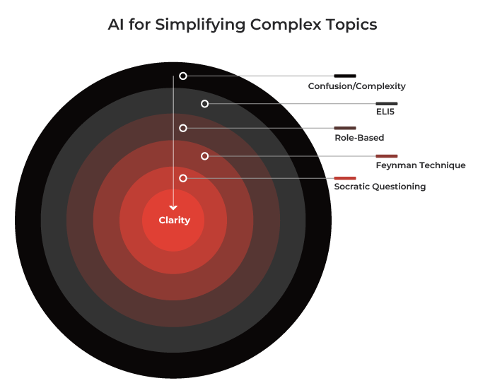
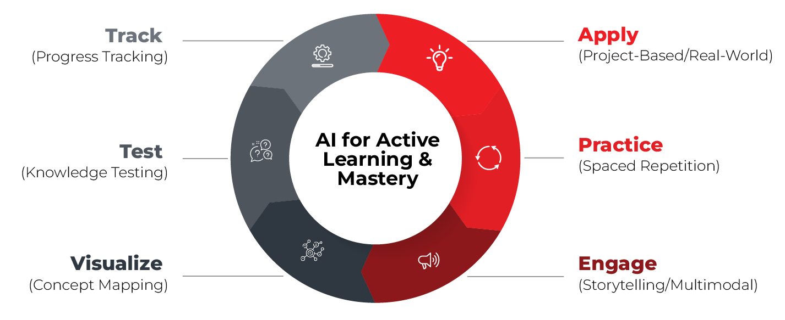
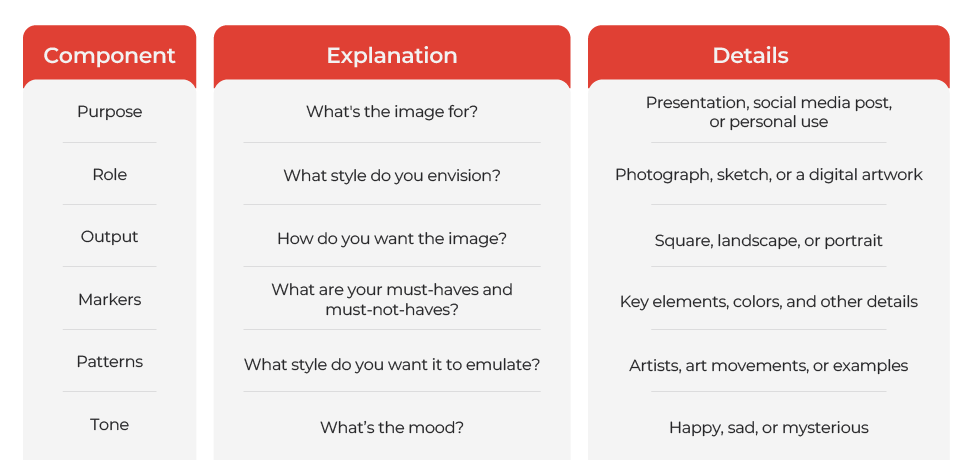
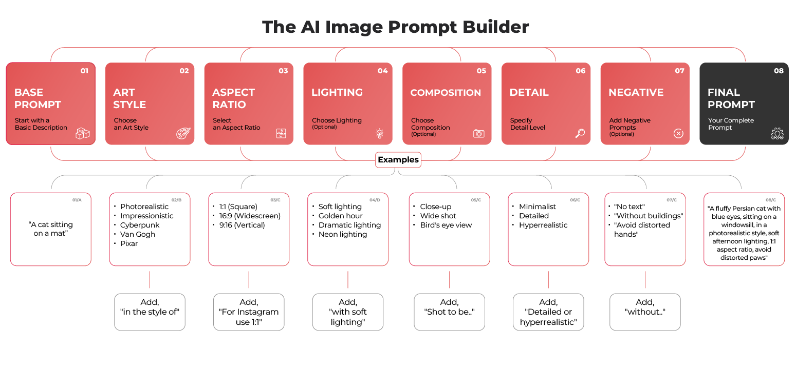

# Summarization Techniques

The 80/20 Summary
- What it is: Highlights the top 20% of content with 80% of key insights.
- Example: Summarize text as bullets, max 20 words per point, focusing on impact.
- When to Use: For quick, essential info from long or complex documents.
- How it Works: Prioritizes measurable or surprising findings in a concise list.

The Role-Playing Summary
- What it is: Summarizes from a specific role’s perspective (e.g., CEO) with tailored implications.
- Example: CEO summary in three paragraphs, focusing on financial risks.
- When to Use: For targeted summaries for different stakeholders or professions.
- How it Works: Adapts tone and format to the role, highlighting relevant impacts.

The One-Sentence Summary
- What it is: Captures the main idea in one concise sentence.
- Example: "The report outlines key AI trends for 2025."
- When to Use: For quick overviews like headlines or titles.
- How it Works: Focuses on the core idea, avoiding extra details.

The Methodology Summary
- What it is: Summarizes research or process methods (e.g., sample size, analysis).
- Example: List sample size, data collection, techniques, and limitations.
- When to Use: For understanding study or process details in academic work.
- How it Works: Extracts specific methodological components clearly.

The Source-Referenced Summary
- What it is: Summarizes with paraphrased quotes and page numbers for verification.
- Example: "Key finding [Page 1] └─ Supporting Quote: '…'"
- When to Use: For accurate summaries of legal or academic texts.
- How it Works: Links summary points to original text evidence.

The Iterative Summary
- What it is: Refines an existing summary (e.g., more concise, focused on a topic).
- Example: "Refine summary, making it more concise."
- When to Use: To adjust a summary to specific needs.
- How it Works: Applies explicit changes to improve the initial output.

The Keyword-Focused Summary
- What it is: Summarizes text focusing on specific keywords (e.g., "carbon emissions").
- Example: Summary on "carbon emissions, renewable energy, policy impact."
- When to Use: For targeted info on particular topics within a text.
- How it Works: Highlights and mentions specified keywords explicitly.

The Comparative Summary
- What it is: Compares two concepts (e.g., A vs. B) in a table with similarity scores.
- Example: Table comparing Concept A and B, with a synthesis.
- When to Use: To understand differences and similarities between ideas.
- How it Works: Uses a 2-column table and concludes with a synthesis.

The Problem/Solution Summary
- What it is: Identifies the main problem and proposed solutions.
- Example: "Problem: X; Solution(s): Y and Z."
- When to Use: For quick insight into challenges and fixes.
- How it Works: Labels and separates problem and solution sections.

The Visual Summary
- What it is: Turns text into visuals (diagram, bar chart, annotations).
- Example: Diagram + chart of concept frequencies + 2 annotations.
- When to Use: For presentations or visual learners.
- How it Works: Creates data-rich visuals to show relationships and patterns.

# Learning with AI

The ELI5 (Explain Like I'm 5) Prompt
  - What it is: Explains a topic like to a 5-year-old with simple words and examples.
  - Example: "Explain quantum physics with everyday examples, defining terms simply."
  - When to Use: For a basic, jargon-free start on a tough topic.
  - How it Works: Uses child-friendly language and defines key terms.

The Role-Playing Explanation
  - What it is: Explains a topic from a specific role’s view (e.g., scientist).
  - Example: "Explain AI as a scientist, using technical language."
  - When to Use: To see a topic from different professional angles.
  - How it Works: Focuses on role-relevant aspects with matching language.

The Feynman Technique (Teach to Learn)
  - What it is: Lets you explain a topic while AI asks questions to spot gaps.
  - Example: "I’ll explain gravity; ask questions and suggest improvements."
  - Prompt: 
    > "I want to learn about [complex topic]. I will attempt to explain it to you. Ask me clarifying questions, as if you were a student completely unfamiliar with the topic. Identify any gaps or inaccuracies in my explanation, and suggest ways to improve my understanding."
  - When to Use: To test and improve your understanding.
  - How it Works: AI provides feedback through interactive dialogue.

The Socratic Questioning (Deep Dive)
  - What it is: Explores a topic with 5+ rounds of deepening questions.
  - Example: "Explore AI with basic then deeper questions."
  - Prompt:
    > Let's explore [complex topic] using Socratic questioning. Start with a basic question, and then ask follow-up questions based on my answers. Progressively deepen the questions, challenging my assumptions and leading me to a more nuanced understanding. Aim for at least 5 question rounds.
  - When to Use: To challenge assumptions and gain deeper insight.
  - How it Works: Builds understanding through layered questioning.

The Analogy Generator
  - What it is: Explains a topic with a relatable everyday analogy.
  - Example: "Explain electricity with an analogy, showing how it maps back."
  - When to Use: To make abstract ideas concrete and memorable.
  - How it Works: Links the concept to a familiar example with explanation.

The Beginner's Mind
  - What it is: Explains a topic from scratch with plain terms and examples.
  - Example: "Explain blockchain assuming I know nothing, with examples."
  - When to Use: For starting fresh on a new, complex topic.
  - How it Works: Builds from basics with clear definitions.

The Jargon Buster
  - What it is: Translates complex text into plain English, defining terms.
  - Example: "Simplify this AI text, avoiding jargon, define key terms."
  - When to Use: For understanding jargon-heavy texts easily.
  - How it Works: Replaces technical terms with simple language.

The Step-by-Step Breakdown
  - What it is: Breaks a topic into 3-5 simple, sequential steps.
  - Example: "Break down machine learning into 3-5 steps."
  - When to Use: For structured understanding of processes.
  - How it Works: Lists steps from basic to complex.

The Real-World Example
  - What it is: Gives three real-life examples tied to a topic’s principles.
  - Example: "Show three examples of AI in healthcare, linked to principles."
  - When to Use: To see practical applications of abstract ideas.
  - How it Works: Connects examples to core concepts.

The Misconception Identifier
  - What it is: Lists three common misconceptions and corrects them.
  - Example: "List three misconceptions about climate change, explain fixes."
  - When to Use: To clear up confusion on a topic.
  - How it Works: Identifies and corrects misunderstandings simply.

# Interactive learning with AI

The Concept Mapper (Visual Overview)
- What it is: Creates a visual map of a topic’s ideas and connections.
- Example: "Create a concept map for machine learning with Mermaid syntax, beginner level."
- When to Use: To see how concepts relate visually.
- How it Works: Builds a hierarchy with main ideas, details, and adjustable depth.

The Spaced Repetition Scheduler (Memory Booster)
- What it is: Sets a review schedule using forgetting curve intervals.
- Example: "Schedule learning AI over 14 days with flashcards and analogies."
- When to Use: To retain knowledge long-term.
- How it Works: Plans reviews (e.g., 1, 3, 7 days) with mixed practice questions.

The Storyteller (Engaging Narrative)
- What it is: Turns a topic into a fun story with characters and metaphors.
- Example: "Turn physics into an adventure story with analogies."
- When to Use: For memorable learning of dry topics.
- How it Works: Uses plot and metaphors to explain key principles.

The Multimodal Explorer (Sensory Learning)
- What it is: Suggests activities for visual, auditory, and kinesthetic learning.
- Example: "Suggest activities for learning coding: infographic, song, model."
- When to Use: To engage all senses in learning.
- How it Works: Lists low-resource activities for each sense.

The Project Planner (Hands-On Application)
- What it is: Designs a project to apply a skill practically.
- Example: "Plan a project to learn Python with goals and milestones."
- Prompt:
  > Help me design a project to learn [skill/topic] through practical application. Include project goals, milestones, resources needed, potential challenges, and a plan for documenting my learning process (e.g., a journal or video log). Break the project down into manageable steps. Predict 3 common pitfalls for this project and how to avoid them.
- When to Use: To gain hands-on skills.
- How it Works: Outlines goals, steps, resources, and pitfalls.

The Real-World Connector (Practical Relevance)
- What it is: Links a topic to your job or life with examples.
- Example: "Show how AI applies to my coding job, ask 2 questions."
- When to Use: To see practical value.
- How it Works: Tailors examples and asks for personalization.

The Knowledge Tester (Assessment Generator)
- What it is: Creates an assessment to test topic understanding.
- Example: "Make a 5-question quiz on AI with an answer key."
- When to Use: To check and reinforce learning.
- How it Works: Generates varied questions with explanations.

# AI for content creation

Creating blog posts

Chain Prompting for Better Output: Instead of asking ChatGPT to do everything in one go, break it into steps (chain prompting).

Step 1 – Idea Generation
- Act as an experienced content strategist. Suggest 10 engaging blog post titles about “AI for small business,” optimized for SEO, each under 60 characters.

Step 2 – Outline Creation
- Take the title “AI Tools Every Small Business Should Try” and create a detailed blog outline with headings, subheadings, and bullet points.

Step 3 – Draft Writing
- Using the outline above, write the first draft of the blog post (~1200 words). Keep the tone friendly and conversational, and make sure each section includes an example.

Step 4 – Optimization
- Rewrite the draft with shorter sentences, better flow, and stronger SEO keywords.

Few-Shot Learning Example for Style Control: Few-shot learning means you give ChatGPT examples of what you want before asking it to generate new content.

Prompt:
<blockquote>
Here are two examples of my blog writing style:

Example 1:
“AI isn’t just for Silicon Valley tech bros — it’s becoming the secret weapon for mom-and-pop stores too. From automating invoices to predicting customer needs, AI is quietly revolutionizing small business life.”

Example 2:
“Think of AI as your tireless intern: it never sleeps, it learns fast, and it doesn’t spill coffee on your desk. Whether it’s answering customer queries or crunching sales numbers, AI’s making big business tricks available to everyone.”

Now, write an intro paragraph for a blog titled “How AI Can Save You Hours Every Week” in the same style as these examples.
</blockquote>

# AI for Image generation

